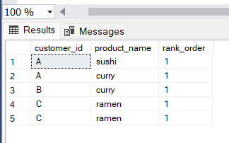
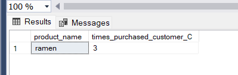
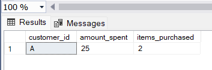

# Danny_Diner

## Problem Statement
Danny wants to use the data to answer a few simple questions about his customers, especially about their visiting patterns, how much money they’ve spent, and which menu items are their favourite. Having this deeper connection with his customers will help him deliver a better and more personalised experience for his loyal customers.
He plans on using these insights to help him decide whether he should expand the existing customer loyalty program - additionally he needs help to generate some basic datasets so his team can easily inspect the data without needing to use SQL.

## The Dataset
- I created our dannys_diner database

`Create Database dannys_diner;`
- Then I created the three(3) tables: sales, menu and members

`CREATE Table sales("customer_id" VARCHAR(1) ,"order_date" DATE, "product_id" INTEGER);`

`CREATE Table menu("product_id" INTEGER, "product_name" VARCHAR(10), "price" INTEGER);`

`CREATE Table members("customer_id" VARCHAR(1), "join_date" DATE);`

- Then I populated the tables with the data provided

---
sales

  `INSERT INTO sales("customer_id", "order_date", "product_id")`

  `VALUES`

	  ('A', '2021-01-01', '1'),
 
	  ('A', '2021-01-01', '2'),
 
	  ('A', '2021-01-07', '2'),
 
	  ('A', '2021-01-10', '3'),
 
	  ('A', '2021-01-11', '3'),
 
	  ('A', '2021-01-11', '3'),
 
	  ('B', '2021-01-01', '2'),
 
	  ('B', '2021-01-02', '2'),
 
	  ('B', '2021-01-04', '1'),
 
	  ('B', '2021-01-11', '1'),
 
	  ('B', '2021-01-16', '3'),
   
     ('B', '2021-02-01', '3'),
 
	  ('C', '2021-01-01', '3'),
 
	  ('C', '2021-01-01', '3'),
 
	  ('C', '2021-01-07', '3');
---
menu

`INSERT INTO menu("product_id", "product_name", "price")`

`VALUES`

	('1', 'sushi', '10'),
 
	('2', 'curry', '15'),
 
	('3', 'ramen', '12');

---
members

`INSERT INTO members("customer_id", "join_date")`

`VALUES`

    ('A', '2021-01-07'),
  
    ('B', '2021-01-09');
  
 ---
 I used the `SELECT` statement to view the tables created.
 
`SELECT * FROM sales;`

`SELECT * FROM menu;`

`SELECT * FROM members;`

## Case Study Questions
1. What is the total amount each customer spent at the restaurant?
2. How many days has each customer visited the restaurant?
3. What was the first item from the menu purchased by each customer?
4. What is the most purchased item on the menu and how many times was it purchased by all customers?
5. Which item was the most popular for each customer?
6. Which item was purchased first by the customer after they became a member?
7. Which item was purchased just before the customer became a member?
8. What is the total items and amount spent for each member before they became a member?

## Analysis
1. The total amount each customer spent at the restaurant

`SELECT DISTINCT(customer_id), SUM(price) AS amount_spent FROM sales S JOIN menu M ON S.product_id = M.product_id
GROUP BY customer_id;`

---
2. Number of days each customer visited the restaurant

`SELECT DISTINCT(customer_id), COUNT(DISTINCT(order_date)) AS number_of_days FROM sales GROUP BY customer_id;`

---
3. First item purchased by each customer

`SELECT customer_id, product_name, rank_order FROM
(SELECT customer_id, product_name, order_date, DENSE_RANK() OVER(PARTITION BY customer_id ORDER BY order_date) AS rank_order
FROM sales S JOIN menu M on S.product_id = M.product_id) AS rank_table WHERE rank_order = 1;`

---
4. Most purchased item and how many times it was purchased

`SELECT product_name, COUNT(S.product_id) AS times_purchased FROM sales S JOIN menu M on S.product_id = M.product_id
GROUP BY product_name
ORDER BY times_purchased DESC;`

---
5. Most popular item for each customer

I split this into three for each customer

Customer A

`SELECT product_name, COUNT(S.product_id) AS times_purchased_customer_A FROM sales S JOIN menu M 
ON S.product_id = M.product_id WHERE customer_id = 'A'
GROUP BY product_name
ORDER BY times_purchased_customer_A DESC;`

_**Ramen**_ is the most popular item with Customer A

Customer B

`SELECT product_name, COUNT(S.product_id) AS times_purchased_customer_B FROM sales S JOIN menu M 
ON S.product_id = M.product_id WHERE customer_id = 'B'
GROUP BY product_name
ORDER BY times_purchased_customer_B DESC;`

For customer B, _**ramen**_, _**curry**_, and _**sushi**_ are evenly distributed.

Customer C

`SELECT product_name, COUNT(S.product_id) AS times_purchased_customer_C FROM sales S JOIN menu M 
ON S.product_id = M.product_id WHERE customer_id = 'C'
GROUP BY product_name
ORDER BY times_purchased_customer_C DESC;`

Customer C only purchases _**ramen**_

---
6. First item purchase after membership

Customer A

`SELECT customer_id, order_date, S.product_id, product_name FROM sales S JOIN menu M
ON S.product_id = M.product_id WHERE customer_id = 'A' AND order_date >= '2021-01-07'
ORDER BY order_date ASC;`

The first item purchased by customer A after being a member is _**curry**_

Customer B

`SELECT customer_id, order_date, S.product_id, product_name FROM sales S JOIN menu M
ON S.product_id = M.product_id WHERE customer_id = 'B' AND order_date >= '2021-01-09'
ORDER BY order_date ASC;`

The first item purchased by customer B after being a member is _**sushi**_

Customer C
Customer C according to the members table is not a member so he did not buy anything after becoming a member.

---
7. Last item purchased before membership

Customer A

`SELECT customer_id, order_date, S.product_id, product_name FROM sales S JOIN menu M
ON S.product_id = M.product_id WHERE customer_id = 'A' AND order_date < '2021-01-07'
ORDER BY order_date DESC;`

The first item purchased by customer A after being a member is _**sushi**_

Customer B

`SELECT customer_id, order_date, S.product_id, product_name FROM sales S JOIN menu M
ON S.product_id = M.product_id WHERE customer_id = 'B' AND order_date < '2021-01-09'
ORDER BY order_date DESC;`

The first item purchased by customer B after being a member is _**sushi**_

Customer C
Customer C according to the member's table is not a member so the item he bought before becoming a member cannot be determined.

8. Total item and amount spent by each customer before membership

Customer A

`SELECT DISTINCT(customer_id), SUM(price) AS amount_spent, COUNT(S.product_id) AS items_purchased FROM sales S JOIN menu M ON S.product_id = M.product_id
WHERE customer_id = 'A' AND order_date < '2021-01-07'
GROUP BY customer_id;`

Customer A purchased a total of _2_ items summing up to _$25_ before becoming a member

Customer B

`SELECT DISTINCT(customer_id), SUM(price) AS amount_spent, COUNT(S.product_id) AS items_purchased FROM sales S JOIN menu M ON S.product_id = M.product_id
WHERE customer_id = 'B' AND order_date < '2021-01-09'
GROUP BY customer_id;`

Customer B purchased a total of _3_ items summing up to _$40_ before becoming a member

